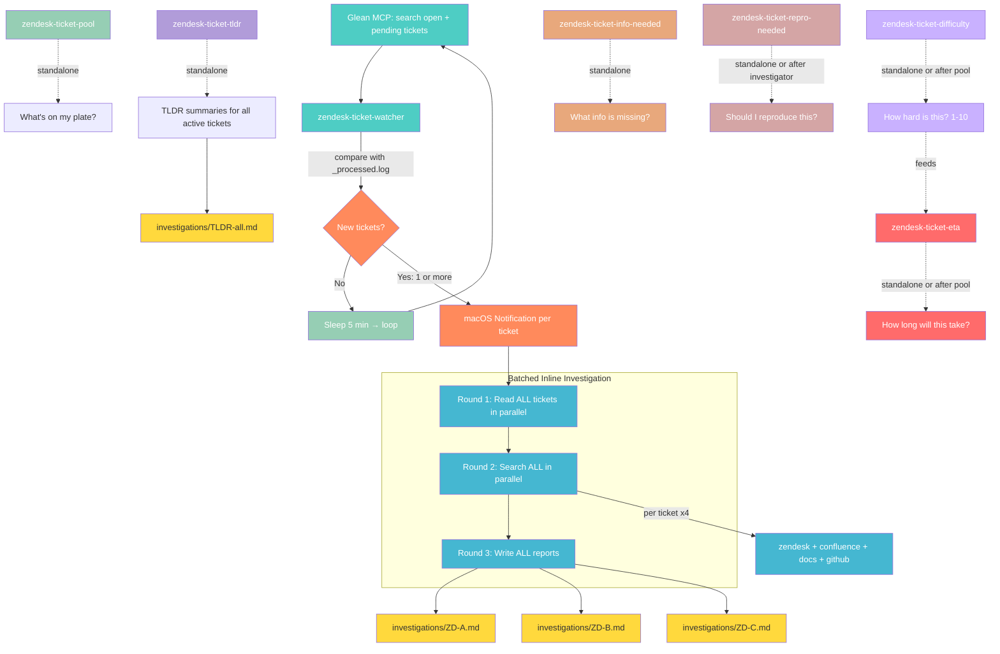

# Datadog Cursor Diagnose Skills

A collection of Cursor IDE Agent Skills for streamlining Datadog Technical Support workflows.

## Purpose

This repository contains reusable Agent Skills that teach Cursor's AI assistant how to perform specialized TSE tasks: checking ticket queues, monitoring for new assignments, recording screens, managing text shortcuts, and more.

Skills live **both locally** (`~/.cursor/skills/`) and in this GitHub repo for versioning and sharing.

## Available Skills

| Skill | Description | Trigger | Prerequisites |
|-------|-------------|---------|---------------|
| `zendesk-ticket-watcher` | **Autonomous background watcher** — loops in a dedicated chat, detects new Zendesk tickets via Glean, sends macOS notifications, investigates inline with batched parallel calls | "start the ticket watcher", "watch my tickets" | Glean MCP |
| `zendesk-ticket-investigator` | Deep investigation of a specific ticket — reads content, searches similar cases, checks docs & GitHub code, gathers customer context, writes report | "investigate ticket #XYZ", "look into ZD-XYZ" | Glean MCP |
| `zendesk-ticket-pool` | Check assigned Zendesk tickets (open/pending) with priority, follow-up detection, stale ticket alerts | "check my tickets", "ticket pool" | Glean MCP |
| `zendesk-ticket-classifier` | Classify ticket nature (bug, question, feature request, incident) with confirmation checks | "classify ticket #XYZ", "what type of ticket" | Glean MCP |
| `zendesk-ticket-tldr` | Generate structured TLDR summaries for all active tickets where you have responded — includes issue, investigation, next steps, need from customer | "tldr my tickets", "standup notes", "ticket summaries" | Glean MCP |
| `zendesk-ticket-routing` | Identify which TS specialization and engineering team owns a ticket topic | "which spec", "route ticket" | Glean MCP |
| `zendesk-ticket-info-needed` | Estimate what customer info is still missing — reads ticket + Confluence troubleshooting guide, outputs gap analysis + copy-paste customer message | "what info do I need for #XYZ", "what to ask for ZD-XYZ" | Glean MCP |
| `zendesk-ticket-repro-needed` | Evaluate whether a ticket needs hands-on reproduction — decision tree + suggested environment type (minikube, docker, cloud sandbox) | "should I reproduce #XYZ", "repro needed for ZD-XYZ" | Glean MCP |
| `zendesk-ticket-difficulty` | Score ticket difficulty 1-10 based on issue type, product count, environment complexity, reproduction need, and escalation likelihood | "difficulty for #XYZ", "how hard is #XYZ" | Glean MCP |
| `zendesk-ticket-eta` | Estimate time of resolution — active work time, calendar time, time to next response, with blockers flagged and confidence level. Calibrated by similar resolved tickets | "ETA for #XYZ", "how long for ZD-XYZ" | Glean MCP |
| `flare-network-analysis` | Analyze a locally extracted Datadog Agent flare for forwarder/intake connectivity issues — produces structured summary with transaction stats, error breakdown, diagnose.log results, and verdict (Healthy/Degraded/Critical) | "analyze flare network", "flare connectivity", "forwarder analysis" | Local flare directory |
| `snagit-screen-record` | Start Snagit video capture via text or voice command | "start recording", "record screen" | Snagit 2024, Accessibility permissions |
| `text-shortcut-manager` | Scan Cursor transcripts for recurring phrases, create espanso text shortcuts automatically | "scan my patterns", "add shortcut" | espanso (`brew install espanso`) |

## Installation

### Local Setup

Clone into your personal Cursor skills directory:

```bash
git clone https://github.com/ddalexvea/datadog-cursor-diagnose-skills.git ~/.cursor/skills
```

Cursor automatically discovers skills from `~/.cursor/skills/*/SKILL.md`.

### Prerequisites

- **Cursor IDE** with Agent mode enabled
- **macOS** (skills use AppleScript and macOS-specific paths)
- **Glean MCP** configured in Cursor (for all `zendesk-*` skills)
- **espanso** (`brew install espanso`) for `text-shortcut-manager`
- **Snagit 2024** for `snagit-screen-record`

## How Skills Work

Skills are markdown instruction files that the AI agent reads when it determines they're relevant. They provide:

1. **Step-by-step workflows** - What tools to call, in what order
2. **Data extraction patterns** - How to parse results
3. **Output formatting** - Consistent, actionable presentation
4. **Domain knowledge** - TSE-specific context the AI wouldn't know

## Zendesk Ticket Pipeline

The Zendesk skills work together as a full ticket pipeline:



| Skill | Answers | Standalone? |
|-------|---------|-------------|
| `zendesk-ticket-watcher` | "Is there a new ticket?" | Yes — loops in dedicated chat |
| `zendesk-ticket-classifier` | "What kind of ticket is it?" | Yes — "classify ticket #XYZ" |
| `zendesk-ticket-investigator` | "What's the context & similar cases?" | Yes — "investigate ticket #XYZ" |
| `zendesk-ticket-routing` | "Who handles it?" | Yes — "which spec for ticket #XYZ" |
| `zendesk-ticket-tldr` | "What's the full status of my tickets?" | Yes — "tldr my tickets" |
| `zendesk-ticket-pool` | "What's on my plate right now?" | Yes — "check my tickets" |
| `zendesk-ticket-info-needed` | "What info is missing from the customer?" | Yes — "what info do I need for #XYZ" |
| `zendesk-ticket-repro-needed` | "Should I spin up an environment to test this?" | Yes — "should I reproduce #XYZ" |
| `zendesk-ticket-difficulty` | "How hard is this ticket? (1-10)" | Yes — "difficulty for #XYZ" |
| `zendesk-ticket-eta` | "How long will this take?" | Yes — "ETA for #XYZ" |

Each skill works **standalone** or as part of the pipeline. No cron, no extensions — just agents following instructions.

## Syncing Local <-> GitHub

Since skills live in `~/.cursor/skills/`, sync changes with:

```bash
cd ~/.cursor/skills
git add -A && git commit -m "Update skills" && git push
```

## Related Projects

- [datadog-cursor-diagnose-rules](https://github.com/ddalexvea/datadog-cursor-diagnose-rules) - Diagnostic rules for flare analysis and troubleshooting

## Maintainer

Alexandre VEA
Datadog Technical Support
