# Datadog Cursor Diagnose Skills

A collection of Cursor IDE Agent Skills for streamlining Datadog Technical Support workflows.

## Purpose

This repository contains reusable Agent Skills that teach Cursor's AI assistant how to perform specialized TSE tasks: checking ticket queues, monitoring for new assignments, investigating tickets, downloading flares, analyzing diagnostics, and more.

Skills live **both locally** (`~/.cursor/skills/`) and in this GitHub repo for versioning and sharing.

## Architecture — Chrome JS Bridge

All `zendesk-*` skills access Zendesk data in **real-time** through Chrome's authenticated session, bypassing Glean MCP's ~30 minute indexing latency. Glean remains available as a fallback and for cross-system searches (Confluence, Salesforce, GitHub).

```mermaid
flowchart LR
    A["🤖 Cursor Agent"] -->|"zd-api.sh read 1234567"| B["📜 osascript"]
    B -->|"execute javascript"| C["🌐 Chrome + Zendesk 🔐"]
    C -->|"sync XHR → /api/v2/*"| D["☁️ Zendesk API"]
    D -->|"JSON"| C -->|"formatted stdout"| B --> A

    A -.->|"fallback"| E["🔍 Glean MCP"]

    style A fill:#1a1a2e,color:#fff
    style B fill:#333,color:#fff
    style C fill:#4285f4,color:#fff
    style D fill:#03363d,color:#fff
    style E fill:#457b9d,color:#fff
```



### How It Works

1. **`zd-api.sh`** wraps all Zendesk API calls into simple CLI commands
2. Uses **`osascript`** (macOS) to inject JavaScript into Chrome
3. JavaScript makes **synchronous `XMLHttpRequest`** calls to Zendesk's REST API
4. Chrome's **existing auth session** provides authentication — no API keys needed
5. Results flow back through `osascript` stdout to the agent
6. If Chrome is unavailable, skills fall back to **Glean MCP**

### Token Optimization

The `zd-api.sh` helper is optimized to minimize token consumption:

```mermaid
flowchart LR
    subgraph Endpoints["Zendesk API Endpoints"]
        E1["/api/v2/tickets/ID.json"]
        E2["/api/v2/tickets/ID/comments.json"]
        E3["/api/v2/search.json"]
    end

    subgraph Before["❌ Raw Output"]
        B1["50+ tags — ~400 tk"]
        B2["3000 chars/comment — ~6,750 tk"]
        B3["All tags × N tickets — ~3,200 tk"]
        B4["2 calls per ticket"]
    end

    subgraph After["✅ zd-api.sh Output"]
        A1["13 filtered tags — ~80 tk"]
        A2["500 chars/comment — ~1,125 tk"]
        A3["7 fields extracted — ~600 tk"]
        A4["1 combined read call"]
    end

    E1 --> B1 -->|"⬇ 80%"| A1
    E2 --> B2 -->|"⬇ 83%"| A2
    E3 --> B3 -->|"⬇ 81%"| A3
    E1 & E2 --> B4 -->|"⬇ 50%"| A4

    style Endpoints fill:#03363d,color:#fff
    style Before fill:#c1121f,color:#fff
    style After fill:#2d6a4f,color:#fff
```



| Optimization | Technique | Savings |
|---|---|---|
| **Tag filtering** | Only extract 13 useful categories (product, tier, complexity, impact, spec, account, mrr, org, region, critical, hipaa, top75, replies) from 50+ raw tags | ~80% |
| **Comment truncation** | Default 500 chars/body, configurable (pass `0` for full) | ~83% |
| **Search compaction** | Extract key metadata fields from tags instead of dumping all | ~81% |
| **Combined `read`** | Single call fetches ticket metadata + all comments | 50% fewer calls |

## Available Skills

### Zendesk Skills (real-time via Chrome JS + Glean fallback)

| Skill | Description | Trigger |
|-------|-------------|---------|
| `zendesk-ticket-pool` | Check assigned tickets (open/pending) with priority, product, tier, follow-up detection, stale alerts | "check my tickets", "ticket pool" |
| `zendesk-ticket-watcher` | Autonomous background watcher — loops in a dedicated chat, detects new tickets, sends macOS notifications, investigates inline | "start the ticket watcher" |
| `zendesk-ticket-investigator` | Deep investigation — reads content, searches similar cases, checks docs & GitHub, gathers customer context, writes report | "investigate ticket #1234567" |
| `zendesk-ticket-tldr` | Generate structured TLDR summaries for all active tickets where you've responded — issue, investigation, next steps, need from customer | "tldr my tickets", "standup notes" |
| `zendesk-ticket-classifier` | Classify ticket nature (bug, question, feature request, incident) | "classify ticket #1234567" |
| `zendesk-ticket-routing` | Identify owning TS specialization, engineering team, Slack channels, CODEOWNERS | "which spec for #1234567", "route ticket" |
| `zendesk-ticket-info-needed` | Gap analysis — reads ticket + Confluence guide, outputs what's missing + copy-paste customer message | "what info do I need for #1234567" |
| `zendesk-ticket-repro-needed` | Evaluate if hands-on reproduction is needed — decision tree + suggested environment | "should I reproduce #1234567" |
| `zendesk-ticket-difficulty` | Score difficulty 1-10 based on issue type, products, environment, reproduction, escalation | "difficulty for #1234567" |
| `zendesk-ticket-eta` | Estimate time of resolution — active work, calendar time, blockers, confidence level | "ETA for #1234567" |
| `zendesk-org-disable` | Handle org disable end-to-end — determines account type, checks parent/child, finds CSM, generates 10-step workflow | "disable org for #1234567" |
| `zendesk-attachment-downloader` | Download ticket attachments via Chrome — lists files, triggers native downloads, extracts flares, offers analysis | "download attachments from #1234567" |

### Flare Analysis Skills (local)

| Skill | Description | Trigger |
|-------|-------------|---------|
| `flare-network-analysis` | Analyze agent flare for forwarder/intake connectivity — transaction stats, error breakdown, diagnose.log, verdict | "analyze flare network" |
| `flare-profiling-analysis` | Analyze Go profiling (pprof) from flare — heap diffs, CPU hotspots, block/mutex contention, escalation summary | "analyze flare profiling" |

### Utility Skills

| Skill | Description | Trigger | Prerequisites |
|-------|-------------|---------|---------------|
| `snagit-screen-record` | Start Snagit video capture via text or voice | "start recording" | Snagit 2024 |
| `text-shortcut-manager` | Scan transcripts for recurring phrases, create espanso shortcuts | "scan my patterns" | espanso |

### Shared

| Path | Description |
|------|-------------|
| `_shared/zd-api.sh` | Centralized Chrome JS bridge — all Zendesk API calls in one script (see `_shared/README.md` for full docs) |

## Zendesk Ticket Pipeline


| Skill | Answers | Data Source |
|-------|---------|-------------|
| `zendesk-ticket-pool` | "What's on my plate right now?" | `zd-api.sh search` (real-time) |
| `zendesk-ticket-watcher` | "Is there a new ticket?" | `zd-api.sh search` + `replied` |
| `zendesk-ticket-investigator` | "What's the context & similar cases?" | `zd-api.sh read` + Glean search |
| `zendesk-ticket-tldr` | "What's the full status of my tickets?" | `zd-api.sh read` + `replied` |
| `zendesk-ticket-classifier` | "What kind of ticket is it?" | `zd-api.sh read` |
| `zendesk-ticket-routing` | "Who handles it?" | `zd-api.sh ticket` (tags) |
| `zendesk-ticket-info-needed` | "What info is missing?" | `zd-api.sh read 0` (full) |
| `zendesk-ticket-repro-needed` | "Should I reproduce?" | `zd-api.sh read` |
| `zendesk-ticket-difficulty` | "How hard? (1-10)" | `zd-api.sh read` |
| `zendesk-ticket-eta` | "How long?" | `zd-api.sh read 0` (full) |
| `zendesk-org-disable` | "How do I disable this org?" | `zd-api.sh read 0` (full) |
| `zendesk-attachment-downloader` | "Download the flare" | `zd-api.sh attachments` + `download` |

Each skill works **standalone** or as part of the pipeline. No cron, no extensions — just agents following instructions.

## Key Features & Design Decisions

### Real-Time Zendesk Access via Chrome JS
- **Problem**: Glean MCP indexes Zendesk data with up to 30 minutes latency, making real-time ticket detection unreliable.
- **Solution**: Inject JavaScript into Chrome via `osascript` to call Zendesk REST API using the browser's existing authenticated session. No API keys needed.
- **Quirk**: Requires Chrome's "Allow JavaScript from Apple Events" setting (View > Developer menu). This is a one-time toggle.

### Dynamic Agent Identity
- **Problem**: Hardcoding agent names breaks portability and leaks PII.
- **Solution**: `zd-api.sh me` calls `/api/v2/users/me.json` to dynamically resolve the current agent's ID, name, and email. All skills use this instead of hardcoded values.

### Token-Optimized Output
- **Problem**: Raw Zendesk API responses dump 50+ tags per ticket and full comment bodies, consuming excessive context window tokens.
- **Solution**: `zd-api.sh` filters tags to only 13 useful categories and truncates comment bodies to 500 chars by default (configurable: pass `0` for full body when deep reading is needed).

### Automated Attachment Downloads
- **Problem**: Glean MCP cannot download binary attachments (flares, screenshots). Agents needed manual intervention.
- **Solution**: `zendesk-attachment-downloader` uses Chrome DOM manipulation — creates a `<a download>` element and clicks it programmatically — to trigger native browser downloads. Works for any attachment type.
- **Quirk**: Downloads go to Chrome's default download directory (`~/Downloads/`). The skill auto-extracts `.zip` flares and offers to run `flare-network-analysis` or `flare-profiling-analysis`.

### Factorized Chrome JS Helper (`zd-api.sh`)
- **Problem**: Each skill had 20-40 lines of inline `osascript` + JavaScript, duplicated across 12 prompt files.
- **Solution**: Centralized `_shared/zd-api.sh` script with 9 commands (`tab`, `me`, `ticket`, `comments`, `read`, `replied`, `search`, `attachments`, `download`). Skill prompts now use 1-line calls.
- **Quirk**: Uses synchronous `XMLHttpRequest` (deprecated in modern browsers but required here because `osascript` cannot handle async callbacks).

### Combined `read` Command
- **Problem**: Reading a ticket required two separate calls (`ticket` + `comments`), doubling tool call overhead.
- **Solution**: `zd-api.sh read <ID>` makes both API calls in a single Chrome JS execution and returns combined output.

### Glean as Fallback, Not Primary
- **Problem**: Glean is powerful for cross-system search but slow for real-time Zendesk data.
- **Solution**: Chrome JS is the primary data source for all Zendesk operations. Glean is used for:
  - Fallback when Chrome is unavailable
  - Cross-system searches (similar tickets, Confluence docs, Salesforce customer context, GitHub code)
  - Deep investigation where broader context is needed

### Background Watcher Without Infrastructure
- **Problem**: Traditional ticket monitoring requires cron jobs, extensions, or external services.
- **Solution**: `zendesk-ticket-watcher` runs as a looping agent in a dedicated Cursor chat — no cron, no launchd, no browser extensions. Just an AI agent following a prompt that says "loop forever, check every 5 minutes."
- **Quirk**: Investigations run inline (no subagents) because Cursor subagents require manual "Allow" clicks, which defeats background automation.

### Replied Detection for Smart Filtering
- **Problem**: TLDR and watcher skills would process tickets the agent hasn't touched yet, wasting time.
- **Solution**: `zd-api.sh replied <ID>` checks if the current agent (via `me.json`) has posted any comment on the ticket. Returns `REPLIED` or `NOT_REPLIED`. Skills use this to skip unhandled tickets.

## Installation

### Local Setup

Clone into your personal Cursor skills directory:

```bash
git clone https://github.com/ddalexvea/datadog-cursor-diagnose-skills.git ~/.cursor/skills
```

Cursor automatically discovers skills from `~/.cursor/skills/*/SKILL.md`.

### Prerequisites

- **Cursor IDE** with Agent mode enabled
- **macOS** (skills use AppleScript and macOS-specific paths)
- **Google Chrome** with a Zendesk tab open and "Allow JavaScript from Apple Events" enabled
- **Glean MCP** configured in Cursor (fallback for Zendesk + cross-system searches)
- **espanso** (`brew install espanso`) for `text-shortcut-manager`
- **Snagit 2024** for `snagit-screen-record`

### One-Time Chrome Setup

```bash
# Enable JavaScript from Apple Events (requires Chrome restart)
defaults write com.google.Chrome AppleScriptEnabled -bool true
```

Then in Chrome: **View > Developer > Allow JavaScript from Apple Events** (check it).

## Syncing Local <-> GitHub

Since skills live in `~/.cursor/skills/`, sync changes with:

```bash
cd ~/.cursor/skills
git add -A && git commit -m "Update skills" && git push
```

## Related Projects

- [datadog-cursor-diagnose-rules](https://github.com/ddalexvea/datadog-cursor-diagnose-rules) - Diagnostic rules for flare analysis and troubleshooting

## Maintainer

Datadog Technical Support
