# Shared Zendesk API Helper — `zd-api.sh`

Centralized Chrome JS bridge for all `zendesk-*` skills. Replaces 20-40 line inline `osascript` blocks with 1-line calls.

## Architecture


## Command Map

```mermaid
flowchart TD
    CLI["zd-api.sh &lt;command&gt;"]

    CLI --> tab["tab"]
    CLI --> me["me"]
    CLI --> ticket["ticket &lt;ID&gt;"]
    CLI --> comments["comments &lt;ID&gt; [chars]"]
    CLI --> read["read &lt;ID&gt; [chars]"]
    CLI --> replied["replied &lt;ID&gt;"]
    CLI --> search["search &lt;QUERY&gt;"]
    CLI --> attachments["attachments &lt;ID&gt;"]
    CLI --> download["download &lt;URL&gt; &lt;NAME&gt;"]

    tab -->|"Find Zendesk tab index"| T1["osascript → tab index"]
    me -->|"GET /api/v2/users/me.json"| T2["id | name | email"]
    ticket -->|"GET /api/v2/tickets/ID.json"| T3["subject, status, priority<br>+ filtered tags"]
    comments -->|"GET /api/v2/tickets/ID/comments.json"| T4["[n] AUTHOR | date<br>body (truncated)"]
    read -->|"ticket + comments combined"| T5["metadata + all comments<br>in ONE call"]
    replied -->|"me.json + comments.json"| T6["REPLIED / NOT_REPLIED"]
    search -->|"GET /api/v2/search.json"| T7["id | status | priority<br>product | tier | complexity"]
    attachments -->|"comments.json → attachments[]"| T8["filename | size | type | url"]
    download -->|"DOM: createElement('a').click()"| T9["triggers Chrome download"]

    style CLI fill:#e63946,color:#fff
    style read fill:#457b9d,color:#fff
    style T5 fill:#457b9d,color:#fff
```



## Token Optimization

```mermaid
flowchart LR
    subgraph Endpoints["Zendesk API Endpoints"]
        E1["/api/v2/tickets/ID.json"]
        E2["/api/v2/tickets/ID/comments.json"]
        E3["/api/v2/search.json"]
    end

    subgraph Before["❌ Raw Output"]
        B1["50+ tags — ~400 tk"]
        B2["3000 chars/comment — ~6,750 tk"]
        B3["All tags × N tickets — ~3,200 tk"]
        B4["2 calls per ticket"]
    end

    subgraph After["✅ zd-api.sh Output"]
        A1["13 filtered tags — ~80 tk"]
        A2["500 chars/comment — ~1,125 tk"]
        A3["7 fields extracted — ~600 tk"]
        A4["1 combined read call"]
    end

    E1 --> B1 -->|"⬇ 80%"| A1
    E2 --> B2 -->|"⬇ 83%"| A2
    E3 --> B3 -->|"⬇ 81%"| A3
    E1 & E2 --> B4 -->|"⬇ 50%"| A4

    style Endpoints fill:#03363d,color:#fff
    style Before fill:#c1121f,color:#fff
    style After fill:#2d6a4f,color:#fff
```



| Optimization | Technique | Savings |
|---|---|---|
| **Tag filtering** | Only extract 13 useful categories (product, tier, complexity, impact, spec, account, mrr, org, region, critical, hipaa, top75, replies) from 50+ raw tags | ~80% |
| **Comment truncation** | Default 500 chars/body, configurable (pass `0` for full) | ~83% |
| **Search compaction** | Extract key metadata fields from tags instead of dumping all | ~81% |
| **Combined `read`** | Single call fetches ticket metadata + all comments | 50% fewer calls |

## Tag Filtering

Only 13 useful tag categories are extracted from 50+ raw tags:


## Skill Integration


## Usage Examples

```bash
# Quick triage (500 char comments)
zd-api.sh read 1234567

# Full investigation (complete comments)
zd-api.sh read 1234567 0

# Search my open tickets (compact output)
zd-api.sh search "type:ticket assignee:me status:open"

# Check if I already replied
zd-api.sh replied 1234567

# Just tags for routing
zd-api.sh ticket 1234567

# Download a flare
zd-api.sh attachments 1234567
zd-api.sh download "https://zendesk.com/attachments/..." "flare.zip"
```

## Prerequisites

- **macOS** with `osascript`
- **Google Chrome** running with a Zendesk tab open
- **Allow JavaScript from Apple Events** enabled (Chrome > View > Developer)
