# Shared Zendesk API Helper — `zd-api.sh`

Centralized Chrome JS bridge for all `zendesk-*` skills. Replaces 20-40 line inline `osascript` blocks with 1-line calls.

## Architecture


## Command Map

```mermaid
flowchart TD
    CLI["zd-api.sh &lt;command&gt;"]

    CLI --> tab["tab"]
    CLI --> me["me"]
    CLI --> ticket["ticket &lt;ID&gt;"]
    CLI --> comments["comments &lt;ID&gt; [chars]"]
    CLI --> read["read &lt;ID&gt; [chars]"]
    CLI --> replied["replied &lt;ID&gt;"]
    CLI --> search["search &lt;QUERY&gt;"]
    CLI --> attachments["attachments &lt;ID&gt;"]
    CLI --> download["download &lt;URL&gt; &lt;NAME&gt;"]

    tab -->|"Find Zendesk tab index"| T1["osascript → tab index"]
    me -->|"GET /api/v2/users/me.json"| T2["id | name | email"]
    ticket -->|"GET /api/v2/tickets/ID.json"| T3["subject, status, priority<br>+ filtered tags"]
    comments -->|"GET /api/v2/tickets/ID/comments.json"| T4["[n] AUTHOR | date<br>body (truncated)"]
    read -->|"ticket + comments combined"| T5["metadata + all comments<br>in ONE call"]
    replied -->|"me.json + comments.json"| T6["REPLIED / NOT_REPLIED"]
    search -->|"GET /api/v2/search.json"| T7["id | status | priority<br>product | tier | complexity"]
    attachments -->|"comments.json → attachments[]"| T8["filename | size | type | url"]
    download -->|"DOM: createElement('a').click()"| T9["triggers Chrome download"]

    style CLI fill:#e63946,color:#fff
    style read fill:#457b9d,color:#fff
    style T5 fill:#457b9d,color:#fff
```



## Token Optimization

```mermaid
flowchart TD
    subgraph Before["❌ Before — Raw Output"]
        B_tags["Tags: 50+ tags\nauto_bb, bb_notified, bulk_ccs_disabled,\npt_product_type:dbm, account_type:prospect,\nt_not_available, mrr_not_available_in_zendesk,\norg:1200625669, org_region_north_america_west,\nspec_dbm_ticket, ticket_complexity_low,\nimpact_general, 1_agent_replies, ...\n\n~400 tokens"]
        B_comments["Comments: 3000 chars/each\n9 comments × 3000 chars\n= ~27,000 chars\n\n~6,750 tokens"]
        B_search["Search: all tags per ticket\n8 tickets × 50 tags\n= ~400 tags dumped\n\n~3,200 tokens"]
        B_calls["2 tool calls per ticket\nticket() + comments()"]
    end

    subgraph After["✅ After — Filtered Output"]
        A_tags["Tags: 7 key fields\nproduct:dbm, account:prospect,\ntier:t_not_available, complexity:low,\nimpact:general, org_id:1200625669,\nregion:north_america_west\n\n~80 tokens"]
        A_comments["Comments: 500 chars/each\n(tunable, 0 = full)\n9 × 500 = ~4,500 chars\n\n~1,125 tokens"]
        A_search["Search: extracted metadata\n8 × 7 fields\nid|status|priority|product|tier|complexity|updated|subject\n\n~600 tokens"]
        A_calls["1 tool call per ticket\nread() = ticket + comments"]
    end

    B_tags -->|"80% reduction"| A_tags
    B_comments -->|"83% reduction"| A_comments
    B_search -->|"81% reduction"| A_search
    B_calls -->|"50% fewer calls"| A_calls

    style Before fill:#c1121f,color:#fff
    style After fill:#2d6a4f,color:#fff
```



## Tag Filtering

Only 13 useful tag categories are extracted from 50+ raw tags:


## Skill Integration


## Usage Examples

```bash
# Quick triage (500 char comments)
zd-api.sh read 1234567

# Full investigation (complete comments)
zd-api.sh read 1234567 0

# Search my open tickets (compact output)
zd-api.sh search "type:ticket assignee:me status:open"

# Check if I already replied
zd-api.sh replied 1234567

# Just tags for routing
zd-api.sh ticket 1234567

# Download a flare
zd-api.sh attachments 1234567
zd-api.sh download "https://zendesk.com/attachments/..." "flare.zip"
```

## Prerequisites

- **macOS** with `osascript`
- **Google Chrome** running with a Zendesk tab open
- **Allow JavaScript from Apple Events** enabled (Chrome > View > Developer)
