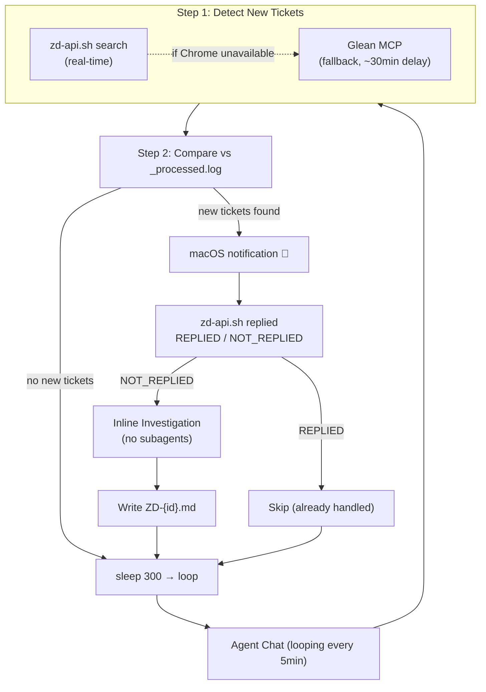

# Ticket Watcher

Autonomous background watcher that runs in a dedicated Cursor chat, checking Zendesk for new ticket assignments via Chrome JS execution (real-time, no delay) or Glean MCP (fallback). When new tickets are found, it sends macOS notifications and investigates each ticket inline (no subagents, no approval clicks needed).

## Prerequisites

- **macOS** with `osascript`
- **Google Chrome** running with a tab open on `zendesk.com`
- **"Allow JavaScript from Apple Events"** enabled in Chrome (View > Developer > Allow JavaScript from Apple Events) — one-time setup

## Architecture

No cron, no launchd, no extensions. Just an agent following instructions in its own chat.

## How to Start

1. **Open a new agent chat** (Cmd+L → "+" icon)
2. Type: **"start the ticket watcher"**
3. The agent reads this skill, follows `watcher-prompt.md`, and loops automatically

To stop: just type "stop" in the watcher chat, or close it.

## When This Skill is Activated

If an agent receives a message like "start the ticket watcher", "watch my tickets", or "ticket monitoring":
1. Read `watcher-prompt.md` from this skill folder (`~/.cursor/skills/zendesk-ticket-watcher/watcher-prompt.md`)
2. Follow every step in that file exactly
3. Loop forever until the user says stop

## Files

| File | Purpose |
|------|---------|
| `SKILL.md` | This file — skill definition |
| `watcher-prompt.md` | The looping prompt for the dedicated watcher chat |

For ticket investigation, this skill uses the standalone `zendesk-ticket-investigator` skill (`~/.cursor/skills/zendesk-ticket-investigator/`).

## Output (in workspace `investigations/`)

| File | Purpose |
|------|---------|
| `_processed.log` | Tracks already-seen ticket IDs (prevents duplicates) |
| `_alert.md` | Summary table of newly detected tickets |
| `_last_run.log` | Timestamp of last check (when no new tickets) |
| `ZD-{id}.md` | Individual investigation report per ticket |

## Behavior

### Detection Mode (default)
Every 5 minutes:
1. Search Zendesk via Glean for open + pending tickets assigned to the user
2. Compare against `_processed.log`
3. If new tickets → macOS notification + update `_alert.md`
4. If no new tickets → update `_last_run.log`
5. Sleep 5 minutes → repeat

### Investigation Mode (when new tickets found)
When new tickets are detected, the watcher investigates each ticket **inline** (no subagents — they require manual "Allow" clicks which defeats background automation). For each ticket, it reads the content via Glean, searches for similar cases, checks docs/GitHub, and writes a report to `investigations/ZD-{id}.md`.

### Manual Trigger
If the user asks to check tickets in an existing chat, follow the same steps from `watcher-prompt.md` but without the loop (single pass).

## When Used from Another Chat

If the agent in a regular chat reads this skill, it should:
1. **If asked to "start the watcher"** → Tell the user to open a new chat and type "start the ticket watcher"
2. **If asked to "check for new tickets" (one-time)** → Run steps 1-4 from `watcher-prompt.md` without looping
3. **If asked to "investigate ticket #XYZ"** → Use the `zendesk-ticket-investigator` skill instead
