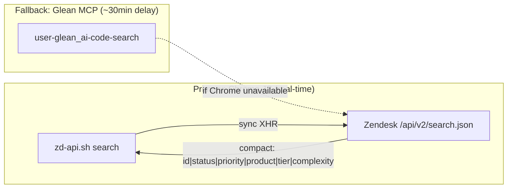

# Zendesk Ticket Pool Checker

## Prerequisites

- **macOS** with `osascript`
- **Google Chrome** running with a tab open on `zendesk.com`
- **"Allow JavaScript from Apple Events"** enabled in Chrome (View > Developer > Allow JavaScript from Apple Events) — one-time setup

## Architecture



## Instructions

### Step 1: Try Chrome JS (Real-Time)

Run BOTH searches in parallel:

```bash
~/.cursor/skills/_shared/zd-api.sh search "type:ticket assignee:me (status:new OR status:open)"
~/.cursor/skills/_shared/zd-api.sh search "type:ticket assignee:me status:pending"
```

Output per ticket: `id | status | priority | product | tier | complexity | replies | updated | subject`

If either returns `ERROR: No Zendesk tab found`, skip to Step 2.

**Optional — fetch a specific view/filter:**

If the user provides a view URL like `https://datadog.zendesk.com/agent/filters/{VIEW_ID}`:

```bash
TAB=$(~/.cursor/skills/_shared/zd-api.sh tab)
# Then use osascript to call /api/v2/views/{VIEW_ID}/execute.json
```

### Step 2: Glean Fallback

Use only if Chrome JS is unavailable.

First, resolve your name (try Chrome JS even if search failed — tab might exist but search timed out):
```bash
AGENT_NAME=$(~/.cursor/skills/_shared/zd-api.sh me | cut -d'|' -f2 | xargs)
```
If that also fails, use `AGENT_NAME` from `zd-api.sh me` output cached earlier, or ask the user.

**Search 1 - Open tickets:**
```
Tool: user-glean_ai-code-search
query: *
app: zendesk
dynamic_search_result_filters: assignee:{AGENT_NAME}|status:open
exhaustive: true
```

**Search 2 - Pending tickets:**
```
Tool: user-glean_ai-code-search
query: *
app: zendesk
dynamic_search_result_filters: assignee:{AGENT_NAME}|status:pending
exhaustive: true
```

**Note:** Glean data may be up to 30 minutes stale. Mention this in the output header.

### Step 3: Parse Ticket Data

From each result, extract:

| Field | Chrome JS Source | Glean Source |
|-------|-----------------|--------------|
| Ticket ID | search output col 1 | URL path |
| Subject | search output last col | `title` |
| Status | search output col 2 | `matchingFilters.status[0]` |
| Priority | search output col 3 | `matchingFilters.priority[0]` |
| Product | search output col 4 | `matchingFilters.producttype[0]` |
| Tier | search output col 5 | `matchingFilters.tier` |
| Complexity | search output col 6 | N/A |
| Replies | search output col 7 | `matchingFilters.label` |
| Critical | search output col 8 (if CRIT) | `matchingFilters.critical[0]` |
| Updated | search output col 9 | `updateTime` |

### Follow-up Detection

A ticket is a **follow-up** when:
1. Subject starts with `Re:`
2. Content contains `follow-up to your previous request #XXXXXX`

When detected:
- Extract the **parent ticket ID**
- Mark with "Follow-up" indicator
- Link parent: `[#parentID](https://datadog.zendesk.com/agent/tickets/parentID)`

### Step 4: Present Results

#### Header

```
## Ticket Pool - [Date] [Time]

**Source:** Chrome JS (real-time) | OR | **Source:** Glean (may be up to 30min stale)

**New:** X | **Open:** Y | **Pending:** Z | **Total: X+Y+Z**
```

#### Table (sorted by priority desc, then last update)

| # | Ticket | Subject | Status | Priority | Customer | Product | Replies | Tier | Updated | Notes |
|---|--------|---------|--------|----------|----------|---------|---------|------|---------|-------|

- Link ticket IDs: `[#ID](https://datadog.zendesk.com/agent/tickets/ID)`
- Truncate subjects to ~50 chars
- Show relative time for Updated (e.g. "2h ago", "1d ago")
- Flag critical tickets with an indicator
- Notes column: "Follow-up from [#parentID](link)" or "Critical" or empty

#### Attention Required

If tickets match BOTH: **Waiting > 24h** AND **10+ replies** → show:

```
### Attention Required - Stale & High-Touch Tickets

| Ticket | Subject | Status | Customer | Replies | Waiting Since |
|--------|---------|--------|----------|---------|---------------|
```

Skip if none match.

#### Action Items

1. **Needs Response** - New/Open tickets waiting for agent reply
2. **SLA Risk** - Critical or high-priority tickets with stale updates
3. **Pending Bump** - Pending tickets that may need customer follow-up
4. **High-Touch Stale** - 10+ replies AND waiting > 24h

### Deep Dive

If asked about a specific ticket, use `~/.cursor/skills/_shared/zd-api.sh read {TICKET_ID}` (or Glean fallback).

## Filtering

Modify the search query:
- By status: `status:open`, `status:pending`, `status:new`
- By priority: `priority:high`, `priority:urgent`
- Combined: `type:ticket assignee:me status:open priority:high`

For Glean fallback, combine filters with `|` in `dynamic_search_result_filters`.
